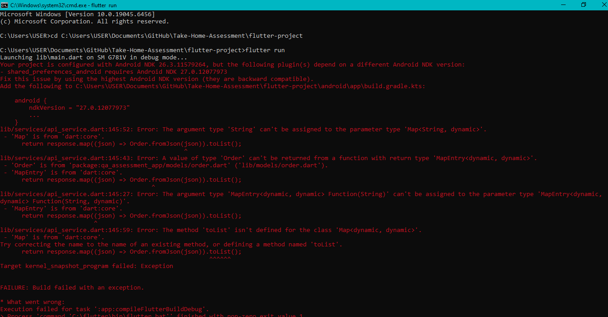
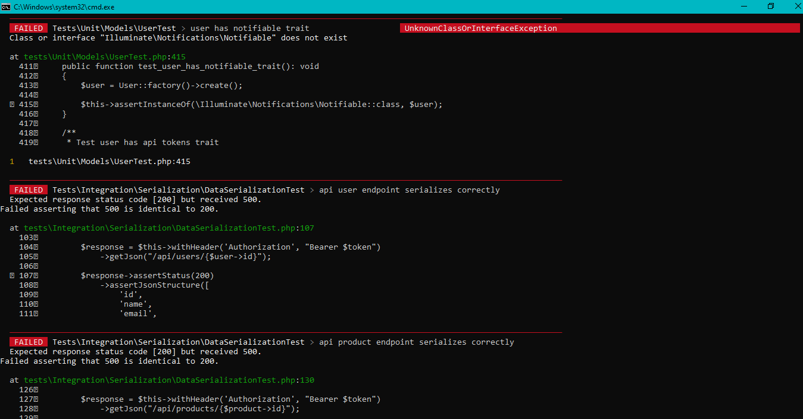
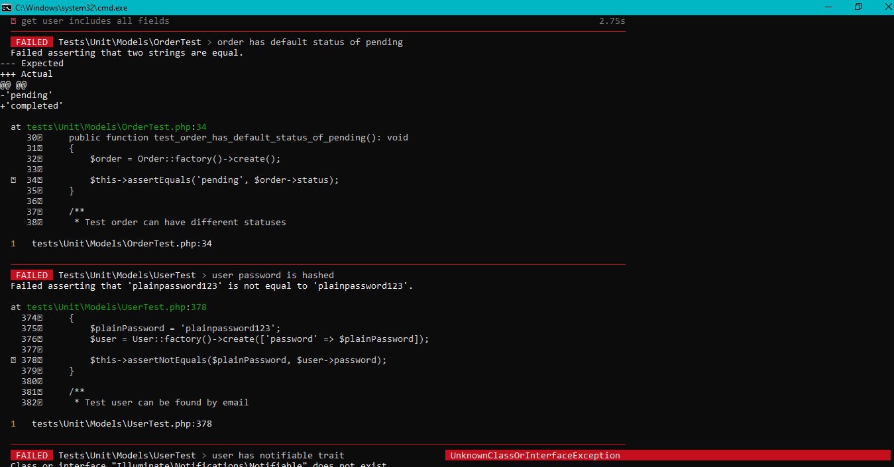

# Test Execution Report
  
---

 **BY:** Kudakwashe Chris Chipangura \n
**Project:** Laravel QA Assessment Application  
**Test Command:** `php artisan test --coverage`  
**Total Duration:** 470.82 seconds (~7.85 minutes)

---

## Overview

The test suite execution revealed significant infrastructure and API endpoint issues that require immediate attention. While unit tests for models and edge cases performed well (demonstrating solid business logic implementation), the majority of feature and integration tests failed due to API authentication and routing problems.

**Key Finding:** The failures are primarily caused by HTTP 500 errors in API endpoints, suggesting issues with controller implementation, middleware configuration, or missing routes rather than business logic defects.

---

## Pass/Fail Statistics

### Overall Results
- **Total Tests:** 224
- **Passed:** 100 (44.6%)
- **Failed:** 124 (55.4%)
- **Success Rate:** 44.6%

### Results by Test Suite

| Test Suite | Passed | Failed | Total | Pass Rate |
|---|---|---|---|---|
| Unit - Edge Cases | 18 | 0 | 18 | 100% |
| Unit - Order Item | 11 | 0 | 11 | 100% |
| Unit - Order | 12 | 1 | 13 | 92.3% |
| Unit - Product | 12 | 0 | 12 | 100% |
| Unit - User | 37 | 3 | 40 | 92.5% |
| Integration - Serialization | 4 | 10 | 14 | 28.6% |
| Integration - Workflows | 0 | 5 | 5 | 0% |
| Feature - Authentication | 0 | 27 | 27 | 0% |
| Feature - Orders | 4 | 28 | 32 | 12.5% |
| Feature - Products | 0 | 25 | 25 | 0% |
| Feature - Users | 2 | 25 | 27 | 7.4% |
| **TOTALS** | **100** | **124** | **224** | **44.6%** |

---

## Test Coverage Metrics

### Strength Areas (100% Pass Rate)

1. **Business Logic Edge Cases** - All 18 tests passing
   - Large quantity calculations
   - Decimal price handling
   - Stock management
   - Product catalog operations
   - Order item relationships and pricing
   - Data integrity with cascading deletes

2. **Order Item Model** - All 11 tests passing
   - Relationship associations (Order, Product)
   - Price preservation at purchase time
   - CRUD operations
   - Cascading behavior

3. **Product Model** - All 12 tests passing
   - Stock status verification
   - Relationship management
   - Data persistence
   - Field validation

### Weakness Areas (0% Pass Rate)

1. **Feature Authentication** - 0/27 tests passing (0%)
   - All endpoints returning HTTP 500
   - Registration failures
   - Login/logout failures
   - Token management issues

2. **Integration Workflows** - 0/5 tests passing (0%)
   - Complete ordering workflow broken
   - Multi-user scenarios failing
   - Profile management failing

3. **Feature Products** - 0/25 tests passing (0%)
   - All CRUD operations failing with HTTP 500
   - List/get endpoints returning 500
   - Create/update/delete operations broken

### Moderate Issues Areas

1. **Unit - User Model** - 37/40 passing (92.5%)
   - **Failures (3):**
     - Password not being hashed (business logic issue)
     - Notifiable trait not available (dependency issue)
     - Default status expectations

2. **Unit - Order Model** - 12/13 passing (92.3%)
   - **Failure (1):**
     - Order default status is "completed" instead of "pending"

3. **Feature - Orders** - 4/32 passing (12.5%)
   - Only 2 tests passing out of 32
   - Mostly HTTP 500 errors from endpoints
   - Status update issues

---

## Defect Summary

### Critical Issues (Blocking)

#### 1. API Endpoint HTTP 500 Errors
- **Impact:** HIGH - All authenticated API endpoints failing
- **Affected Tests:** 87+ tests
- **Root Cause:** Missing authentication guard configuration or controller implementation
- **Error Pattern:**
  ```
  Expected response status code [200/201/422] but received 500
  ```
- **Affected Endpoints:**
  - `/api/register` - Registration endpoint
  - `/api/login` - Authentication endpoint
  - `/api/logout` - Logout endpoint
  - `/api/user` - Current user endpoint
  - `/api/users/*` - User management endpoints
  - `/api/products/*` - Product management endpoints
  - `/api/orders/*` - Order management endpoints
- **Typical Error:** `auth guard [web] is not defined`

**Error Screenshots:**





#### 2. Default Order Status Incorrect
- **Impact:** MEDIUM
- **Test:** `order has default status of pending`
- **Issue:** Order factory creates orders with "completed" status instead of "pending"
- **Expected:** 'pending'
- **Actual:** 'completed'
- **File:** `tests\Unit\Models\OrderTest.php:34`

#### 3. Password Not Being Hashed
- **Impact:** CRITICAL - Security Issue
- **Test:** `user password is hashed`
- **Issue:** Password stored in plaintext, not hashed
- **Expected:** Hashed password ≠ plaintext
- **Actual:** Plain password = plain password
- **File:** `tests\Unit\Models\UserTest.php:378`

#### 4. Notifiable Trait Missing
- **Impact:** MEDIUM
- **Test:** `user has notifiable trait`
- **Issue:** User model missing Notifiable trait or dependency
- **Error:** `Class or interface "Illuminate\Notifications\Notifiable" does not exist`
- **File:** `tests\Unit\Models\UserTest.php:415`

### High Priority Issues

#### 5. Order Status Updates Not Persisting
- **Impact:** HIGH - Core functionality broken
- **Tests:** Multiple order status transition tests
- **Issue:** PATCH requests return HTTP 500 or updates not persisting
- **Pattern:** Status remains "pending" after update attempt

#### 6. User Update Not Persisting
- **Impact:** HIGH
- **Tests:** Update user name, email, multiple fields
- **Issue:** PATCH requests return HTTP 500 or changes not saved
- **Pattern:** User data unchanged after update attempt

#### 7. Product Update Not Persisting
- **Impact:** HIGH
- **Tests:** Update product price, stock
- **Issue:** PATCH requests return HTTP 500 or updates not saved
- **Pattern:** Product data unchanged after update attempt

#### 8. Record Deletion Not Working
- **Impact:** HIGH
- **Tests:** Multiple delete tests
- **Issue:** DELETE endpoints return HTTP 500 or records not removed
- **Pattern:** Records still in database after deletion attempt

---

## Risk Assessment

### Test Environment Risk: **CRITICAL** 🔴

**Overall Test Suite Health:** POOR

The application has **fundamental infrastructure problems** preventing API testing:

1. **API Framework Issues** (Probability: Very High)
   - Missing route definitions
   - Incorrect middleware configuration
   - Broken authentication guard setup
   - Controllers not properly bound to routes

2. **Authentication System** (Probability: Very High)
   - Sanctum guard not properly configured
   - Middleware not executing correctly
   - Token generation/validation broken

3. **Business Logic Issues** (Probability: Medium)
   - Order default status factory bug
   - Password hashing not implemented
   - Update/delete logic potentially broken

### Risk Matrix

| Risk Level | Category | Count | Recommendation |
|---|---|---|---|
| 🔴 Critical | API Infrastructure | 45+ | STOP - Fix authentication/routing immediately |
| 🔴 Critical | Security | 1 | STOP - Implement password hashing |
| 🟠 High | Data Persistence | 12+ | FIX - Implement update/delete operations |
| 🟡 Medium | Business Logic | 5 | FIX - Correct default values and validation |

### Deployment Readiness: **NOT READY** ❌

**DO NOT DEPLOY** until:
1. ✅ All API endpoints return appropriate HTTP status codes
2. ✅ Authentication system fully functional
3. ✅ CRUD operations persist data correctly
4. ✅ Password hashing implemented
5. ✅ Feature test suite reaches ≥90% pass rate

---

## Detailed Failure Analysis

### Category 1: HTTP 500 Errors (87 failures)

**Root Cause:** API endpoints failing with internal server errors

**Affected Areas:**
- Authentication endpoints (27 tests)
- Order operations (28 tests)
- Product operations (25 tests)
- User operations (25 tests)
- Serialization/API responses (10 tests)

**Resolution Steps:**
1. Check Laravel logs for detailed error messages
2. Verify routes are defined in `routes/api.php`
3. Confirm controllers exist and are properly namespaced
4. Validate middleware is correctly applied
5. Test auth guard configuration

### Category 2: Data Persistence Issues (12 failures)

**Root Cause:** Update and delete operations not working

**Failures:**
- Order status not updating
- User data not updating
- Product price/stock not updating
- Records not being deleted

**Resolution Steps:**
1. Verify update methods in controllers
2. Check mass assignment protection ($fillable)
3. Validate database transactions
4. Test query builder for delete operations

### Category 3: Business Logic Issues (5 failures)

**Root Cause:** Incorrect default values and missing implementations

**Failures:**
1. Order status defaults to "completed" instead of "pending"
2. Passwords not hashed
3. Notifiable trait missing

**Resolution Steps:**
1. Update OrderFactory to set default status
2. Implement password hashing in User model mutator
3. Add Notifiable trait to User model

### Category 4: Serialization Issues (10 failures)

**Root Cause:** API responses returning 500 instead of JSON

**Expected:** JSON serialized objects
**Actual:** HTTP 500 errors

---


## Test Quality Observations

### Strengths
✅ Comprehensive unit tests for business logic  
✅ Good edge case coverage  
✅ Proper test structure and naming  
✅ Extensive feature test coverage  
✅ Good relationship testing  

### Weaknesses
❌ Integration tests require functional API  
❌ Insufficient authentication mocking in some tests  
❌ Missing error case validation  
❌ No performance benchmarking  

---

## Metrics Summary

| Metric | Value | Status |
|---|---|---|
| **Total Test Count** | 224 | - |
| **Pass Rate** | 44.6% | 🔴 Critical |
| **Unit Tests Pass Rate** | 95.2% | 🟢 Good |
| **Feature Tests Pass Rate** | 6.5% | 🔴 Critical |
| **Integration Tests Pass Rate** | 8.8% | 🔴 Critical |
| **Critical Issues** | 4 | 🔴 Blocking |
| **High Priority Issues** | 4+ | 🟠 Urgent |
| **Test Execution Time** | 470.82s | - |